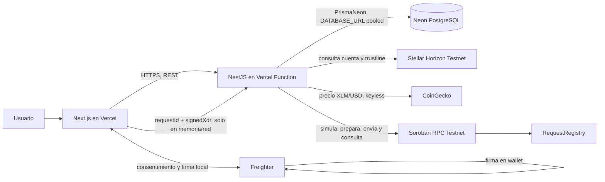

# Arquitectura

Stellar Desk separa la interfaz, la API, el almacenamiento relacional y los
servicios públicos de Stellar. La firma ocurre localmente en Freighter; el
servidor valida y transmite el XDR recibido, pero nunca posee la private key.

## Componentes

- **Web (`apps/web`)**: Next.js App Router. Construye URI SEP-7/QR a partir de
  la respuesta canónica del backend, verifica trustlines, consulta la
  calculadora y coordina el flujo de Freighter.
- **API (`apps/api`)**: NestJS con prefijo `/api/v1`, DTO validation global y
  CORS de un origen. Calcula las URI/huellas, guarda los registros, consulta
  Horizon/CoinGecko y prepara/valida/transmite invocaciones Soroban.
- **Dominio (`packages/stellar-domain`)**: validación Stellar y reglas comunes de
  amount, asset, memo y URI SEP-7.
- **Base de datos (Neon PostgreSQL)**: persiste `requestHash` único,
  `destinationHash`, `memoHash`, metadata de la solicitud y estado de
  `onchainRegistration`. No guarda destination, memo, URI, QR ni `signedXdr`.
- **Contrato (`contracts/request-registry`)**: almacena una estructura mínima
  bajo una clave `BytesN<32>`. No mueve fondos ni tiene administración o
  actualización del contrato.

## Flujo de solicitud

1. El frontend manda destino público, activo/issuer, importe y memo.
2. La API valida los datos, produce la URI SEP-7 exacta y calcula
   `SHA-256(uri)`.
3. Un `requestHash` idéntico reutiliza el mismo registro e ID; `P2002` se
   recupera por hash si dos peticiones compiten.
4. La API devuelve URI, QR, hash, trustline y `existing`; el frontend no
   reconstruye la URI.

## Flujo de registro no custodial

1. API simula `exists` con una `Account` separada y prepara `register` con
   secuencia inicial + 1.
2. El navegador envía el XDR sin firmar a Freighter para obtener consentimiento
   explícito y firma local.
3. El navegador manda `requestId` y `signedXdr` a `POST /registry/submit`.
4. La API verifica contrato, método, cuenta, hash y firmas presentes; transmite
   exactamente esa transacción a Soroban RPC.
5. La API persiste el estado y reconcilia pendientes con
   `GET /registry/:requestId`.

## Entornos

Hay un único `.env` local en la raíz del repositorio. `ConfigModule` resuelve
ese archivo desde `apps/api/src` o `apps/api/dist`; `prisma.config.ts` lo resuelve
desde `apps/api`. En despliegue, Vercel inyecta variables de entorno y no se
sube el archivo local.
